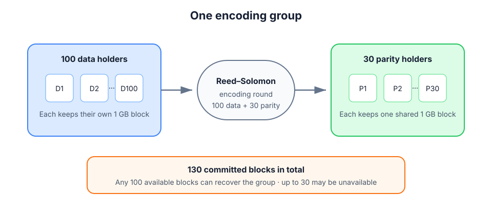
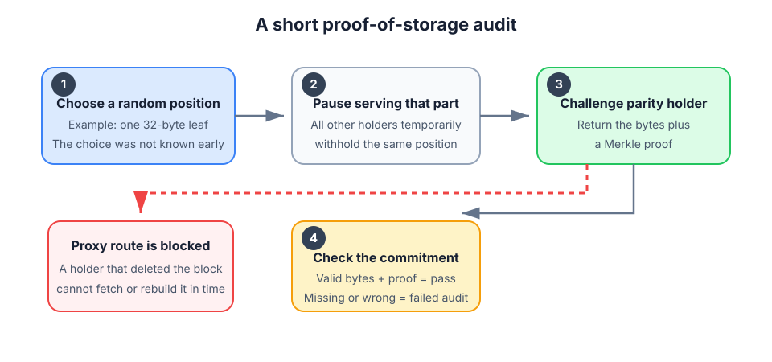

# Reed–Solomon Backup Groups

This is a mutual backup system where people protect one another's data without storing direct copies of one another's files. Each person keeps their own data. The network stores only shared **parity**: recovery information calculated from many people's data at once.

## One backup group

Suppose 100 people each protect a 1 GB block. Reed–Solomon coding turns those 100 data blocks into 30 additional parity blocks. The group now has 130 blocks in total:

- 100 data holders keep their own original blocks.
- 30 parity holders each store one parity block.
- Any 100 of the 130 blocks can rebuild the full set, so the group can lose up to 30 blocks without losing data.

The numbers are only an example. A real group can choose a different balance between storage cost and failure tolerance.

Only parity is stored as someone else's data. Creating a group still requires each data holder to send its block to the encoder once, but copies of all the original files are not spread across the network.

## Fair exchange

Storing a parity block earns credit from every data holder protected by that block. In the 100 + 30 example, each parity holder receives a small credit from each of the 100 data holders.

Roles change between groups. A person may store parity in one group and protect their own data in another. Over time, the ledger keeps the exchange balanced: with a 100-to-30 ratio, a fair long-term mix is roughly three parity roles for every ten data roles.

Each encoding round can choose new participants from a larger network; membership does not have to stay fixed.

Credits do not have to be settled directly between the same two people. They can move through several participants, similar to payments routed through the Lightning Network.

| Role in one group | Keeps | Can request group blocks | Credit |
| --- | --- | --- | --- |
| Data holder | Their own original block | Yes, for recovery | Spends |
| Parity holder | One shared parity block | No; only serves it | Earns |

The role is fixed for the lifetime of a group, even though the same person can have a different role in another group.

## Checking that parity is really stored

A parity holder must not earn credit by acting as a proxy—fetching the block from someone else only when it is checked. The group prevents this with short, repeated audits:

1. The group chooses a random, tiny part of a block, such as 32 bytes.
2. For a short audit window, every other participant stops serving that same part.
3. The group asks the selected parity holder for the bytes and a Merkle proof.
4. The proof is checked against the block's published Merkle root.

If the parity holder deleted the block, it cannot fetch the challenged part from the group or rebuild it from the group's other blocks during the audit window. This also catches a person who created a fake parity identity while participating as a data holder: their own data is not enough to recalculate the missing parity bytes. Audits should happen immediately after upload and then periodically, because a holder could delete data later.

This depends on role-based access rules, coordinated withholding, and a short response deadline. The chosen position must stay unpredictable until the withholding window begins. The audit proves that the target can serve the committed bytes without fetching them from this group; it does not prove where the target physically stores its block.

## Proving correct encoding

Someone must calculate the parity. The simple design chooses one encoder for each group:

1. Data holders publish Merkle roots for their original blocks and send the blocks to the encoder.
2. The encoder calculates the Reed–Solomon parity blocks and their Merkle roots.
3. It sends each parity block to its assigned holder.
4. It publishes a compact computation proof showing that the committed parity was produced from the committed input blocks using the agreed Reed–Solomon rules.

This proof prevents an encoder from filling parity blocks with junk. It is similar to a zero-knowledge proof, but secrecy is not required; the goal is only to prove that the calculation was correct. Having one encoder avoids making every member download all 100 input blocks, although the exact proof system and encoder-selection method still need to be chosen.

## Main properties

- **Low storage overhead:** the example adds 30 GB of parity to protect 100 GB of data.
- **No direct foreign copies:** participants store shared parity, not another person's original block.
- **Failure recovery:** any 100 available blocks can reconstruct a 100 + 30 group.
- **Measured contribution:** parity storage earns credit that can later pay for protection.
- **Proxy resistance:** temporary withholding tests independent availability of the committed block.
- **Verifiable setup:** a computation proof ties every parity block to the agreed source blocks.

The idea is similar to a Reed–Solomon-protected disk array, except the “disks” are people and the parity role rotates between backup groups.
